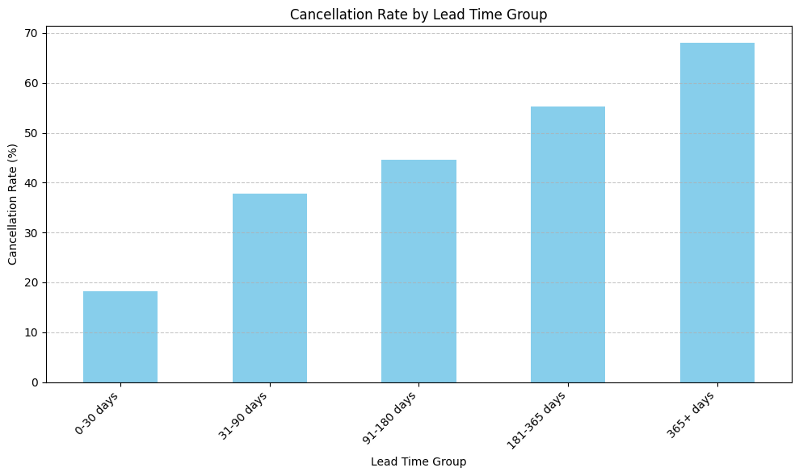

# hospitality-analytics-portfolio
Predictive analytics to reduce hotel booking cancellations.

# Predicting Hotel Cancellations: A Data-Driven Approach to Revenue Protection

**One-line hook:** Leveraging predictive analytics to identify and mitigate high-risk hotel bookings, improving operational efficiency and revenue.

---

## The Business Problem

A Portuguese hotel chain faces significant financial losses due to a high volume of booking cancellations, with approximately 37% of all bookings ultimately being canceled. This project aims to predict which bookings are most likely to be canceled, enabling proactive interventions to reduce lost revenue and optimize resource allocation.

<!--
Tip: Lead with the pain, not the data.
Instead of "This project analyzes a dataset of 119K hotel bookings..."
Try: "A Portuguese hotel chain loses an estimated millions annually to last-minute cancellations..."
-->

## The Data

We analyzed over 119,000 individual hotel bookings from both city and resort hotels, spanning from 2015 to 2017. The dataset captures a wide array of information, including how far in advance guests booked, their travel details, booking channels, and deposit types, providing rich context to understand cancellation patterns. We identified some missing data for 'company' and 'agent' information, which were handled during data preparation.

## Key Discoveries

- **Problematic 'Non Refund' Deposit Policy:** Bookings made with a 'Non Refund' deposit type exhibit a staggering 99.4% cancellation rate, indicating a critical disconnect between the policy and booking outcome.
- **High-Risk 'Groups' Market Segment:** Bookings originating from the 'Groups' market segment show an exceptionally high cancellation rate of over 61%, making them a primary driver of lost revenue compared to other segments.
- **Lead Time Correlates with Cancellation Risk:** The longer the lead time before arrival, the higher the cancellation rate. Bookings made over a year in advance cancel at nearly 68%, versus 18% for bookings within 30 days of arrival.
- **[Finding 4 headline (optional)]:** [1-2 sentences]

<!--
Tip: Write findings as "headlines" a newspaper editor would approve.
Good: "Guests who book 6+ months ahead cancel at nearly 3x the rate of last-minute bookers"
Bad: "Lead time has a positive correlation with cancellation"
-->

## Visualizing the Story

<!-- Embed your most compelling chart. Pick the ONE visual that best captures your main finding. -->

(your_chart_filename.png)

*This chart illustrates how bookings made further in advance (longer lead times) are significantly more prone to cancellation, with cancellation rates increasing steadily with the lead time. This insight is crucial for understanding booking commitment.*

## Prediction Model

Our enhanced Decision Tree model effectively predicts hotel booking cancellations with an accuracy of approximately 84%. This model is a significant improvement over our initial attempt, substantially reducing the number of 'false alarms' (bookings predicted to cancel but actually don't) while still accurately identifying a large portion of actual cancellations. This provides the hotel with a reliable tool to proactively manage at-risk bookings.

## Recommendations

<!--
Tip: Translate model metrics into business impact.
Instead of "The model achieved 78% accuracy..."
Try: "Our model correctly flags 8 out of 10 at-risk bookings, giving the hotel front desk team
enough lead time to proactively reach out and offer flexible rebooking options."
-->

## Recommendations

1.  **Re-evaluate and Clarify the 'Non Refund' Deposit Policy:** Investigate the process and communication around 'Non Refund' bookings given their near 100% cancellation rate. Fixing this could recover thousands of potentially lost bookings annually by guiding guests towards more viable commitment options.
2.  **Implement Targeted Engagement for 'Groups' Market Segment:** Develop a proactive communication strategy (e.g., earlier check-ins, personalized follow-ups) for 'Groups' bookings, which have over a 61% cancellation rate. Reducing 'Groups' cancellations by 10-15% could significantly stabilize occupancy and increase confirmed group revenue.
3.  **Proactive Outreach and Flexibility for Long Lead-Time Bookings:** Introduce automated touchpoints and flexible options (like date changes without penalty) for bookings made more than 180 days in advance, which cancel at up to 68%. This could reduce cancellations for these bookings by an estimated 10-20%, converting at-risk bookings into confirmed stays or allowing timely re-selling of inventory.

## Tools & Techniques

Python | Pandas | Scikit-Learn | Matplotlib | Seaborn | Gaussian Naive Bayes | Google Colab

---

*This project was completed as part of ISOM 835: Predictive Analytics at Suffolk University's
Sawyer Business School.*
